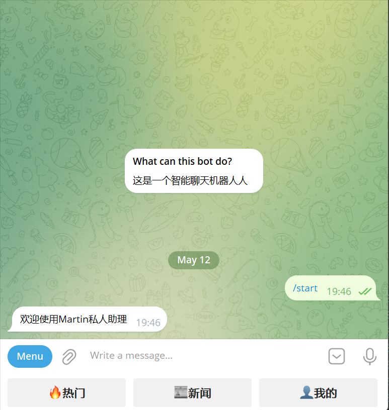
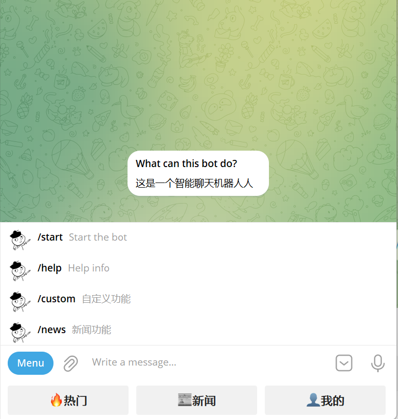

# TGBot

# 简介

这是一个个人娱乐的TelegramBot机器人项目、mysql作为后端存储用户基本信息

包括一下几个功能

- 菜单按钮
- 硅基流动、chatGPT支持
- 每日新闻

# 使用说明

## 安装配置mysql

```mysql
-- 新建一个tgbot库
create database tgbot charset = utf8;
```

## 配置文件

- 按照eg.ini为模板、新建.env文件、填入对应的值即可

- [硅基流动平台注册链接](https://cloud.siliconflow.cn/i/AJcwLpuG)、注册立即送2000万TOKEN

- [API-TOKEN连接](https://cloud.siliconflow.cn/account/ak)（填入配置文件open_key的值）

# 运行程序

CTR + C: STOP

```CMD
python main.py
```

# 效果图




